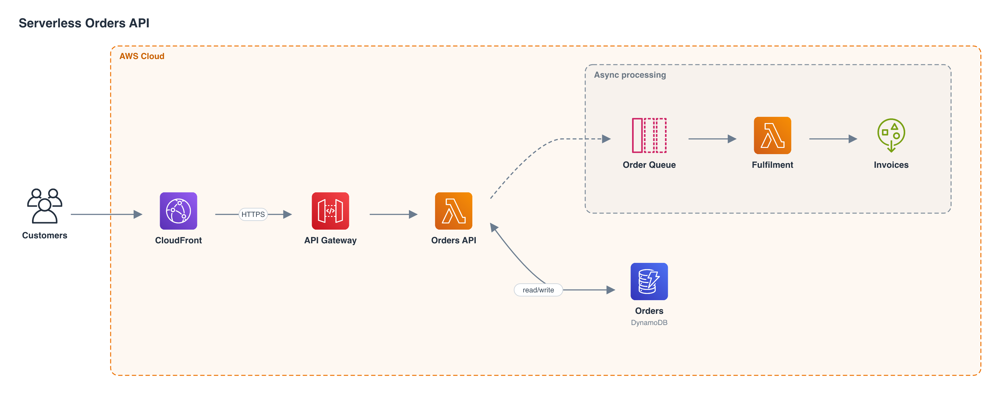
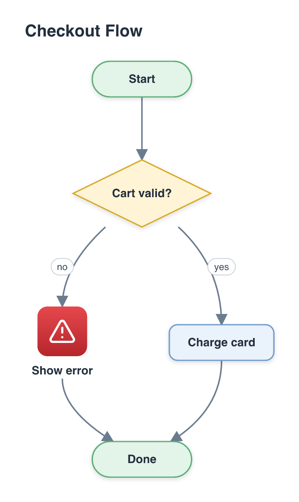
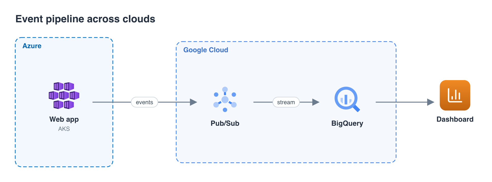
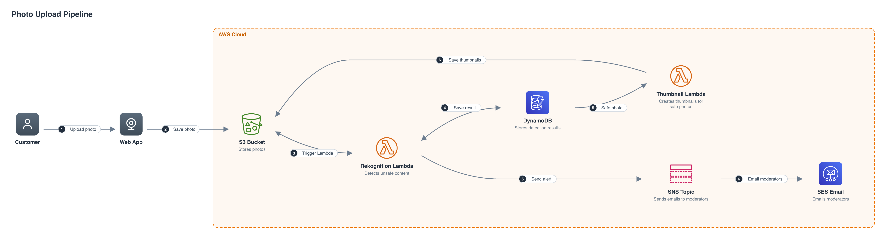

# diagram-mcp

**An MCP server that draws architecture and flow diagrams as PNG images, with AWS, GCP and Azure icons.**
Connect it to Kiro, Claude, Cursor or any MCP client, ask for a diagram, and the picture comes back in the chat and is saved in your project.



## Features

- **Cloud icons**: about 1,700 AWS, GCP, Azure, Kubernetes, SaaS and on-prem icons, plus about 2,100 everyday glyphs (`general:mail`, `general:search`, ...).
- **Architecture and flow diagrams**: icon nodes, flowchart shapes, nested groups (VPC, region, Lambda), dashed edges, return arrows, numbered steps.
- **Automatic layout**: picks left-to-right or top-to-bottom, keeps numbered steps in order, no Graphviz or browser needed.
- **Edit in place**: update a diagram by id instead of regenerating it. Same name replaces, so you never get copies.
- **Plain-language mode** (optional): describe the diagram in words; a local LLM interprets the request, then a reviewer checks and fixes the result, at most 5 passes.
- **Saved next to your code**: PNG and spec go to `<project>/.diagram-mcp/`.
- **Debuggable**: every call gets a `log_id` and a log file the model can read back.

## Quick start

You need Node.js 20 or newer.

```bash
git clone https://github.com/sarweshmaharjan/diagram-mcp.git
cd diagram-mcp
npm install
npm run build
```

Add the server to your MCP client. For Kiro, edit `.kiro/settings/mcp.json` (one project) or `~/.kiro/settings/mcp.json` (all projects):

```json
{
  "mcpServers": {
    "diagram": {
      "command": "node",
      "args": ["/absolute/path/to/diagram-mcp/dist/index.js"]
    }
  }
}
```

Restart or reconnect the server, then ask:

> Draw a simple diagram: user → API Gateway → Lambda → DynamoDB.

Config for Claude Desktop, Cursor and others is in [docs/configuration.md](docs/configuration.md).

## Tools

| Tool             | What it does                                                                                  |
| ---------------- | --------------------------------------------------------------------------------------------- |
| `create_diagram` | Nodes, edges and groups in, PNG out. Creating with an existing `name` replaces that diagram.  |
| `update_diagram` | Add, change or remove nodes, edges and groups of an existing diagram.                         |
| `draw_diagram`   | Plain-language request in, PNG out (interpreter + review loop). Needs a local LLM, see below. |
| `get_diagram`    | Current spec and PNG of a diagram.                                                            |
| `delete_diagram` | Remove a diagram.                                                                             |
| `list_diagrams`  | List the diagrams in the project.                                                             |
| `list_icons`     | Search icons, for example `provider=aws query=lambda`.                                        |
| `get_log`        | Read the debug log of a call by `log_id`.                                                     |

Parameters and examples: [docs/tools.md](docs/tools.md).

## Examples

All images below were produced by this server (`npm run examples`).

| Flow chart                                   | Multi-cloud                                       |
| -------------------------------------------- | ------------------------------------------------- |
|  |  |

## Plain-language mode

`draw_diagram` lets the server do the design work:

```
request → interpreter → render → reviewer → fixes → reviewer … → PNG
          (type, direction,        (max 5 passes)
           icons, nodes, edges)
```

It needs [LM Studio](https://lmstudio.ai) (or any OpenAI-compatible server) with a chat model loaded and the local server running on `http://127.0.0.1:1234`. Without it, `draw_diagram` returns a clear error and every other tool keeps working.



> Unedited output for: _"A customer uploads a photo in a web app. The photo goes to an S3 bucket, which triggers a Lambda function. The Lambda calls Amazon Rekognition to detect unsafe content, then saves the result in DynamoDB. If the photo is safe, a second Lambda creates thumbnails and writes them back to S3. If it is unsafe, an SNS topic emails the moderators."_ (local 14B model). Expect a good draft, not a perfect diagram: the reviewer is the same model checking its own work, so refine with `draw_diagram` + `diagram_id` or `update_diagram`.

How the loop stops, and its settings: [docs/architecture.md](docs/architecture.md#review-loop) and [docs/configuration.md](docs/configuration.md#plain-language-mode-llm).

## Where files go

`<your project>/.diagram-mcp/<name>.png`, plus a `.json` spec next to it (needed for updates) and `logs/`. The client passes your project path as `output_dir`; if it does not, the server falls back to MCP roots, then its working directory, then `~/.diagram-mcp`.

Add `.diagram-mcp/` to your project's `.gitignore` unless you want to commit the diagrams.

## Troubleshooting

Every reply ends with `log_id=...`. Ask the model to call `get_log` with it, or open `.diagram-mcp/logs/<log_id>.json`. The log holds the exact input, the folder chosen and why, inferred icons, and any error.

| Symptom                             | Likely cause and fix                                                                                    |
| ----------------------------------- | ------------------------------------------------------------------------------------------------------- |
| Files land in `~/.diagram-mcp`      | The client did not pass `output_dir` and reports no workspace. Ask it to pass the project path.         |
| `draw_diagram` says LLM unreachable | Start LM Studio's local server, or set `DIAGRAM_MCP_LLM_URL`. Other tools do not need it.               |
| `draw_diagram` times out            | Local models are slow. Raise `DIAGRAM_MCP_LLM_TIMEOUT_MS` and your client's tool timeout if it has one. |
| Wrong icon                          | Use `list_icons` and set `icon` explicitly, or `update_diagram` the node.                               |

## Development

```bash
npm run dev          # run from source
npm run build        # compile to dist/
npm run typecheck    # tsc, including tests
npm run format       # prettier
npm test             # end-to-end check over stdio, sample PNGs in ./out
npm run test:loop    # review-loop stop rules (fake LLM, no LM Studio needed)
npm run live         # draw_diagram against a running LM Studio
npm run examples     # regenerate the images in examples/ and docs/
```

Project layout and design notes: [docs/architecture.md](docs/architecture.md).

## Credits and licenses

- Cloud, on-prem and SaaS icons come from [mingrammer/diagrams](https://github.com/mingrammer/diagrams) (MIT). The artwork belongs to AWS, Google, Microsoft and the other vendors, and their trademark rules apply.
- General icons are [Lucide](https://lucide.dev) (ISC).
- Layout by [dagre](https://github.com/dagrejs/dagre), rendering by [resvg](https://github.com/RazrFalcon/resvg).
- Third-party license texts are in [licenses/](licenses/).
