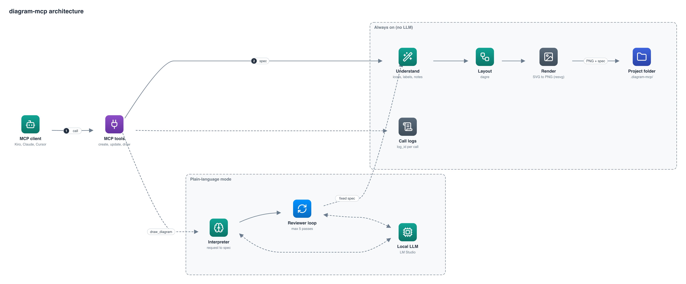

# Architecture



_The diagram above was drawn by diagram-mcp (`npm run examples`)._

## Request path

1. The client calls a tool. `tools/shared.ts` wraps every handler: it opens a log record, and appends `log_id` to the reply.
2. The output folder is resolved (`core/store.ts`).
3. **Understand** (`core/understand.ts`) cleans the spec without any LLM: infers icons from labels, splits long labels into label and detail, and collects notes.
4. **Layout** (`render/index.ts`) uses dagre. With no explicit direction it lays out both LR and TB and keeps the one closest to a 3:2 canvas. Numbered edges out of one node get increasing minimum rank lengths, which places the targets in step order.
5. **Render** builds an SVG and rasterizes it to PNG with resvg. Icons are embedded as data URIs.
6. The PNG and a JSON spec are saved, and the PNG is returned as MCP image content.

## Source layout

```
src/
  index.ts            entry point: stdio transport
  server.ts           creates the server, holds the model-facing instructions
  tools/
    shared.ts         tracing wrapper, output folder, reply building, progress
    diagrams.ts       create / update / get / delete / list
    draw.ts           draw_diagram
    support.ts        get_log, list_icons
  core/
    model.ts          zod schemas, applying updates, validation
    understand.ts     deterministic icon inference and clean-up
    store.ts          output folder rules, files, ids
    logs.ts           per-call log records
  icons/index.ts      icon catalog (cloud PNGs and general glyphs), lookup, search
  render/index.ts     layout and SVG/PNG rendering
  pipeline/
    llm.ts            OpenAI-compatible client (LM Studio)
    interpret.ts      request interpreter
    critic.ts         review loop and rule checks
    pipeline.ts       interpret then refine, plus the reply summary
assets/icons/         icon images
test/                 end-to-end, loop and live checks
scripts/examples.ts   regenerates the images in examples/ and docs/
```

## Plain-language mode

`draw_diagram` runs `pipeline/pipeline.ts`:

1. **Interpret** (`interpret.ts`): the LLM gets the request, the diagram rules and a short icon shortlist built from words in the request, and returns a plan: type, direction with a reason, nodes, edges, groups. Output is constrained by a JSON schema. Icon names that are not in the catalog are dropped and re-inferred by Understand.
2. **Review loop** (`critic.ts`): see below.
3. The final spec goes through the normal render path.

### Review loop

Each pass runs rule checks (unusable spec, too wide or tall, unconnected nodes, dense diagram, long labels, nothing returning from a called node) and asks the LLM to review the spec against the request. The LLM returns a score, issues, and minimal edits in the same format as `update_diagram`. The server applies them and reviews again.

The loop is bounded. It makes **at most 5 reviews** (`MAX_ITERATIONS`) and stops earlier when:

| Reason           | Condition                                                                              |
| ---------------- | -------------------------------------------------------------------------------------- |
| `approved`       | LLM says it matches the request, score is at least 8, and no blocker or major findings |
| `no_progress`    | The same findings repeat, or the proposed edits change nothing                         |
| `regressed`      | A revision scores lower than the best so far; the best version is kept                 |
| `llm_error`      | The LLM fails or times out; the best reviewed version is kept                          |
| `max_iterations` | Five reviews done                                                                      |

Edits the model proposes can be invalid (unknown ids, bad icons). They are rejected, reported back to the model in the next review, and never crash the run. The last edit is never applied without a review after it.

`npm run test:loop` checks these rules with a scripted fake LLM.

## Design choices

- **Deterministic core, LLM on top.** `create_diagram`, `update_diagram` and everything else work without any model. The LLM only adds `draw_diagram`.
- **The diagram id is its file name.** Creating with the same name overwrites, so repeated tries do not pile up copies.
- **Logs for every call.** Wrong output usually comes from the input or the folder choice, so the log records both.
